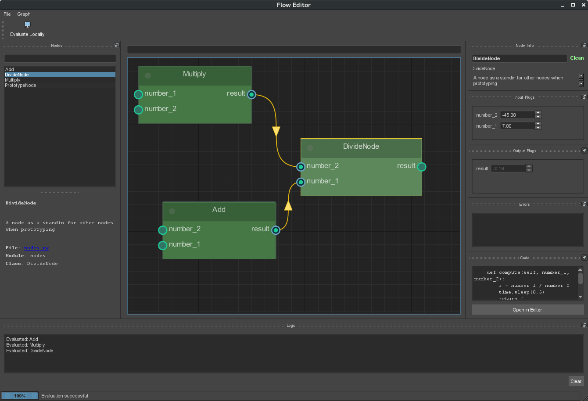

# FlowpipeEditor - Proof of Concept!

Prrof of concept for a visual graph editor for flowpipe.

# How to test

It should run on Python 2 and 3 although I haven't tested it on Python3 yet.

Make sure you have these requirements installed:

    - flowpipe -> latest version
    - PySide2
    - Qt.py

The editor is based on https://github.com/jchanvfx/NodeGraphQt but I have included a slighlty modified version of NodeGraphQt, it just contains a "node selection changed" signal that the current version of the library does not provide. NodeGraphQt is automatically appended to the path when running the test command.

Then run the code in `test_flowpipe_editor.py`.

# Current Features

    - Create Nodes
    - Connect Nodes
    - Evaluate the Graph with interactive feedback
    - Save and load a graph
    - Change values on Plugs
    - Change Node names

# Experimental

    - "PrototypeNode" is meant to design new nodes in the editor and then export them as python code, currently the export to python is not implemented

# Path forward

This is just a proof of concept but I think this has great potential as the underlying node view `NodeGraphQt` is pretty robust and can do almost everything we'd need already.

Once this gains more interest, we have to define a proper path and make some decisions on what the editor should actually do.
